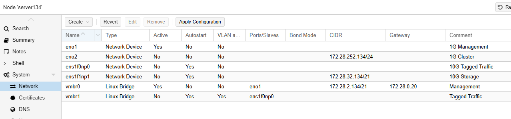

# Networking

We always have a management interface, ideally two, feeding vmbr0.

I use the second 1G interface for cluster interconnectivity. Throughput is not important, but it needs to be low latency.

One of my 10G interfaces connects to vmbr1 to tagged traffic to VMs.

One of my 10G interfaces is dedicated for storage.

<figure><figcaption></figcaption></figure>

### SDN

In VMWare we had the concept of distributed vswitches. Every host in a cluster had access to the same VLAN names, with the same tag ID. We can do the same thing here.

At the Datacentre level, I open SDN and Zones, I define the core network.

<figure><figcaption></figcaption></figure>

Under VMets, I can now define the VLANs for use in this zone.

<figure><figcaption></figcaption></figure>

&#x20;
